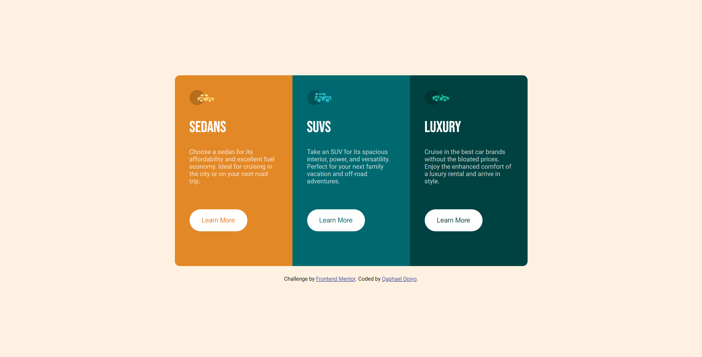
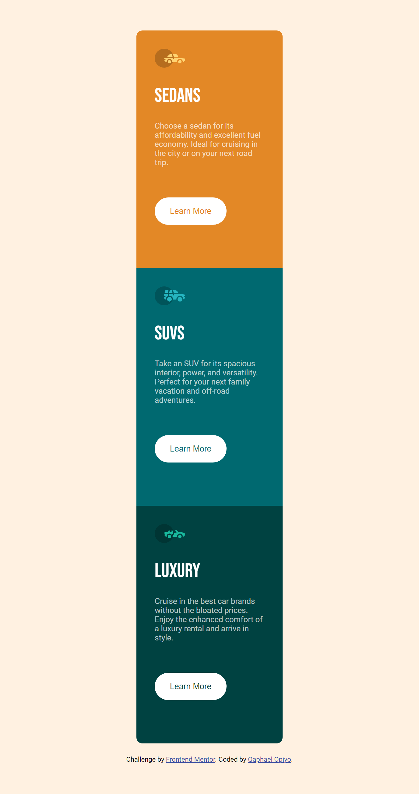

# Frontend Mentor - 3-column preview card component solution

This is a solution to the [3-column preview card component challenge on Frontend Mentor](https://www.frontendmentor.io/challenges/3column-preview-card-component-pH92eAR2-). Frontend Mentor challenges help you improve your coding skills by building realistic projects. 

## Table of contents

-   [Overview](#overview)
  - [The challenge](#the-challenge)
  - [Screenshot](#screenshot)
  - [Links](#links)
  - [Built with](#built-with)
  - [What I learned](#what-i-learned)
  - [Useful resources](#useful-resources)
  - [Author](#author)

## Overview
This is the front end mentor challenge recreation of 3-column preview card component solution I did following my other frontend mentor code challenges

### The challenge

Users should be able to:

- View the optimal layout for the interface depending on their device's screen size
- See hover and focus states for all interactive elements on the page

### Screenshot

### Links

- Solution URL: [github](https://github.com/Qaphael/3-column-preview-card-component-main)
- Live Site URL: [github hosted](https://qaphael.github.io/3-column-preview-card-component-main/)

## My process

### Built with

- Semantic HTML5 markup
- CSS custom properties
- Flexbox
- CSS Grid
- vscode

### What I learned

I learned and practiced a great deal of flex property in this challenge for positioning

### Useful resources

- [unicons icons](https://iconscout.com/unicons) - This helped me for icons.
- [google fonts](https://fonts.google.com/) - This helped me for fonts i used in this challenge.

## Author

- Website - [Qaphael Opiyo](https://qaphael-portfolio-website.web.app/)
- Frontend Mentor - [@yourusername](https://www.frontendmentor.io/profile/Qaphael)
- Twitter - [@yourusername](https://twitter.com/Laflo_lr)
- Github - [@Qaphael](https://github.com/Qaphael)

